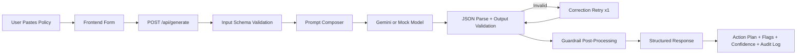

# From Policy Chaos to Execution Clarity: Building a Healthcare Policy-to-Action Copilot (Ideation to Launch)

## Context
Healthcare operations teams depend on policy and SOP documents that are often long, ambiguous, and hard to execute under time pressure. The operational challenge is not access to policy text. The challenge is converting policy text into reliable, role-specific action in minutes.

This project was built to solve exactly that gap.

The result is **Policy-to-Action Copilot**: a system that converts policy text into a structured, audit-ready action plan with risk flags, confidence scoring, and explicit uncertainty handling.

## The Core Problem
A policy can say:
- respond within 30 minutes
- escalate under certain conditions
- avoid sharing sensitive details over insecure channels

But frontline teams still need answers to operational questions:
- what exactly should happen first
- who owns each step
- what deadlines apply
- where policy conflicts exist
- what to communicate to stakeholders right now

Without a system layer, teams manually interpret policy in real time, which creates:
- inconsistent execution
- delayed response
- avoidable compliance risk
- weak auditability

## Users and Jobs-to-be-Done
### Primary users
- Operations leads managing escalations
- Compliance stakeholders validating policy adherence
- Analysts coordinating and documenting workflow execution

### Jobs-to-be-done
- "When I paste policy text, give me an actionable plan I can execute now."
- "Tell me where policy instructions conflict before execution starts."
- "Give me a communication draft that is aligned with policy constraints."
- "Make uncertainty visible instead of hiding it behind fluent output."

## Product Thesis
If policy text can be converted into a structured execution object with guardrails, teams can move faster while reducing interpretation errors.

So the product thesis became:

**Transform policy interpretation from ad-hoc human parsing into a schema-driven, guardrailed AI workflow.**

## Scope Decisions (What was intentionally included)
### Included in v1
- strict input/output schema contracts
- one-click scenario-based demo
- retry-on-invalid-output behavior
- guardrails for ambiguity and conflict
- confidence-based caution signaling
- rate limits for safe public demo usage
- eval harness for behavior checks

### Excluded from v1
- authentication and RBAC
- persistent rate limiting store
- multi-domain expansion beyond healthcare
- deep citation tracing to source spans

This kept scope focused on reliability and decision quality, not feature sprawl.

## System Design Overview
The system has four layers:
1. **Interface layer**: React app for scenario loading, policy input, and structured result display.
2. **Orchestration layer**: serverless API flow handling validation, prompting, retries, and guardrails.
3. **Model layer**: Gemini in live mode, deterministic mock mode for low-cost reliability.
4. **Quality layer**: eval runner with scenario-based pass/fail checks.

### End-to-end flow

## Data Contracts (Why they matter)
The model is not allowed to return freeform prose as the final output. It must return a validated object with required fields:
- summary
- priority
- actions[] with owner and due window
- compliance_flags[] with severity and evidence
- missing_information[]
- stakeholder_update_draft
- confidence_score
- audit_log

This design forces operational completeness.

Schema-first design also gives three benefits:
- deterministic frontend rendering
- predictable downstream integrations
- measurable validation failures instead of silent drift

## Prompting Strategy
The primary prompt enforces:
- JSON-only output
- no fabricated legal/regulatory citations
- explicit handling of missing information
- explicit high-severity flags for conflicting clauses

If the first model response fails schema validation, the system sends a correction prompt containing validation issue details and retries once.

This retry path significantly reduces brittle failures from malformed model output.

## Guardrails and Reliability Controls
Guardrails run after schema validation and enforce deterministic policy:
- detect contradictory timing signals
- ensure at least one high-severity compliance flag when conflicts are detected
- lower confidence when ambiguity/missing critical details appear
- prepend `Caution:` when confidence drops below threshold

Additional controls:
- payload size cap
- CORS allowlist
- backend per-IP daily cap
- frontend session cap (3 successful runs)

Together these controls improve safety, cost control, and demo stability.

## User Journey (End to End)
1. User lands on the demo page and sees the value proposition.
2. User clicks a scenario or pastes policy text.
3. User submits and receives structured results within seconds.
4. User scans prioritized actions and assigned ownership.
5. User reviews compliance flags and evidence.
6. User checks missing information and confidence score.
7. User copies stakeholder update draft and proceeds to execution.

The journey is intentionally short. Time-to-value is the product lever.

## Before vs After
| Dimension | Before | After |
| --- | --- | --- |
| Policy interpretation | Manual and inconsistent | Structured and standardized |
| Time to first action plan | Often delayed by manual parsing | Near-instant generation |
| Conflict visibility | Hidden until late review | surfaced immediately with severity |
| Uncertainty handling | implicit, not documented | explicit via missing info + confidence |
| Audit readiness | fragmented notes | built-in audit log structure |
| UX for trial users | unclear what to do | one-click scenarios + clear output sections |

## Real Value Created
### Operational value
- faster conversion from policy text to executable steps
- clearer ownership and due-window clarity
- reduced ambiguity in handoffs

### Risk value
- early detection of contradictory policy logic
- explicit uncertainty instead of overconfident AI output
- output structure suitable for compliance review workflows

### Product value
- reusable AI workflow pattern:
  - schema contract
  - retry logic
  - guardrails
  - eval harness

This pattern can be ported to other domains (grants, fintech, enterprise operations) with domain adapters.

## AI-Native Product Management Lens: What to get right
### 1) Problem framing before prompting
Do not start with model selection. Start with workflow failure points:
- where decisions break
- where ambiguity causes delay
- where risk is introduced

### 2) Define non-negotiable contracts
Every AI feature needs:
- input contract
- output contract
- error contract

Without these, output quality cannot be operationalized.

### 3) Treat reliability as product scope
Reliability is not an engineering afterthought. It is core UX:
- validation
- retries
- guardrails
- confidence signaling

### 4) Design for unsafe/default model behavior
Assume the model can:
- format output incorrectly
- infer details not present
- appear confident under uncertainty

Then engineer around those behaviors.

### 5) Build evals before launch, not after incidents
Behavioral evals make quality discussable with evidence.
They also turn subjective quality debates into pass/fail checks.

### 6) Plan for cost and abuse from day one
For public demos:
- session limits
- IP caps
- mock mode fallback
- payload constraints

This avoids unbounded spend and downtime during sharing.

### 7) Instrument adoption and failure paths
Track:
- success rate
- validation-failure rate
- guardrail-trigger frequency
- latency
- scenario completion behavior

What is measured can be tuned.

## Launch Strategy
### Phase 1: Internal readiness
- stabilize schemas
- pass eval fixtures
- validate guardrail behavior

### Phase 2: Public demo hardening
- enable rate limits
- configure CORS and env isolation
- verify fallback behavior (mock/live)

### Phase 3: Distribution
- host frontend on GitHub Pages
- host API on Vercel
- include architecture + demo script + scenario walkthroughs

### Phase 4: Post-launch iteration
- collect usage feedback
- analyze failure logs
- adjust prompt and guardrails with eval regression checks

## Implementation Snapshot
- **Frontend**: React + TypeScript + Vite
- **Backend**: Vercel serverless API
- **Validation**: Zod input/output schemas
- **Model adapter**: Gemini + deterministic mock mode
- **Evals**: scenario runner with pass/fail reporting
- **Deployment**: GitHub Pages (UI) + Vercel (API)

## What this project demonstrates
- translating a messy real-world workflow into a precise system contract
- balancing speed with reliability in AI-generated workflows
- designing for operational trust, not just model fluency
- shipping with evals, guardrails, and cost controls built in

## What to improve next
- persistent rate limiting store (KV/Redis)
- source-span citation linking for evidence traceability
- role-based access and audit trails
- richer conflict detection beyond heuristics
- domain plugin architecture for non-healthcare policies

## Final takeaway
The real innovation is not "calling a model API." 
The real innovation is turning policy interpretation into a **reliable decision system** with explicit contracts, measurable quality, and production-aware controls.

That is what makes an AI workflow usable in real operations.
