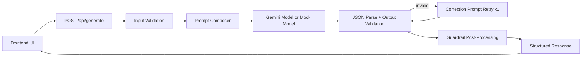

# System Documentation: Policy-to-Action Copilot

## 1. System overview
Policy-to-Action Copilot transforms healthcare policy text into a machine-validated action plan with explicit uncertainty and compliance-risk signaling.

It is designed to demonstrate reliable AI workflow design with:
- deterministic interfaces
- controlled failure handling
- visible guardrails
- eval-driven quality checks

## 2. Product behavior
### Inputs accepted
- policy text (required)
- urgency level
- organization context
- requester role
- fixed domain (`healthcare` in v1)

### Outputs produced
- summary
- priority level
- prioritized actions with ownership and due windows
- compliance flags with evidence
- missing-information list
- stakeholder-ready draft update
- confidence score
- audit log (constraints + assumptions)

## 3. End-to-end architecture


## 4. Code layout and responsibility
- `frontend/src/App.tsx`
  - main UI, form flow, run-limit enforcement, output rendering.
- `frontend/src/scenarios.ts`
  - one-click demo fixtures for UI.
- `backend/api/generate.mjs`
  - HTTP handler, CORS, request size check, IP cap, error shaping.
- `backend/lib/service.mjs`
  - orchestration: validation -> model call -> retry -> guardrails.
- `backend/lib/model.mjs`
  - Gemini integration and deterministic mock mode.
- `backend/lib/prompt.mjs`
  - primary and correction prompts.
- `backend/lib/guardrails.mjs`
  - conflict and ambiguity post-processing rules.
- `backend/lib/rate-limit.mjs`
  - in-memory per-IP/day counter.
- `shared/schema.mjs`
  - canonical Zod contracts for input/output/errors.
- `shared/scenarios.mjs`
  - eval fixtures + expected behavior flags.
- `evals/run-evals.mjs`
  - scenario execution and pass/fail reporting.

## 5. Request lifecycle details
1. Request hits `POST /api/generate`.
2. Payload size and method checks execute.
3. CORS header policy applied.
4. Per-IP daily cap checked.
5. Input validated via `InputSchema`.
6. Prompt generated with hard constraints:
   - return JSON only
   - no fabricated citations
   - explicit missing info
   - explicit conflict flags
7. Model response parsed and validated with `OutputSchema`.
8. If validation fails, one corrective retry runs with issue summary.
9. Guardrails normalize confidence and enforce caution semantics.
10. Structured response returned.

## 6. Prompting and correction strategy
### Primary prompt goals
- force deterministic shape
- preserve evidence linkage
- reduce hallucination risk

### Correction prompt goals
- salvage malformed output quickly
- avoid additional retries and cost
- provide validation issue hints from parser output

Retry policy: exactly one retry after initial invalid output.

## 7. Guardrail logic
Implemented in `backend/lib/guardrails.mjs`:
- conflict signal detection in policy text (contradictory timing patterns)
- ensure high-severity flag exists when conflict detected
- lower confidence when ambiguity or missing critical info is present
- prepend `Caution:` when confidence `< 0.6`

These are deterministic post-processing rules independent of model style.

## 8. Reliability model
### Hard reliability controls
- Zod validation on input and output
- one retry path for invalid output
- controlled error contract
- deterministic eval fixtures

### Controlled error codes
- `BAD_REQUEST`: invalid method/payload/oversize
- `RATE_LIMITED`: session or IP cap reached
- `VALIDATION_FAILED`: schema mismatch
- `MODEL_ERROR`: provider/unexpected runtime failure

## 9. Evaluation framework
`npm run evals` executes all fixtures in `shared/scenarios.mjs`.

Assertions per scenario:
- output validates schema
- required top-level fields are present
- missing information behavior triggers where expected
- high-severity conflict flag appears where expected
- confidence threshold behaves as expected

Output report includes:
- per-scenario PASS/FAIL
- pass rate
- average latency
- failure detail block

## 10. Runtime modes
### Mock mode (`MOCK_MODEL=1`)
- deterministic output
- no external API cost
- suitable for demos/tests

### Live mode (`MOCK_MODEL=0` or unset)
- real Gemini API calls
- requires `GEMINI_API_KEY`
- subject to provider quota limits

## 11. Security and abuse controls
- secrets are backend-only
- no API key exposure in frontend bundle
- CORS allowlist via `ALLOWED_ORIGINS`
- request body cap (60KB)
- per-IP daily request cap (`DAILY_IP_CAP`)
- frontend session run cap (3 successful runs)

## 12. Environment variables
- `GEMINI_API_KEY`: model credential (live mode)
- `GEMINI_MODEL`: model name (default `gemini-2.0-flash`)
- `ALLOWED_ORIGINS`: comma-separated allowed origins
- `DAILY_IP_CAP`: integer daily cap per IP
- `MOCK_MODEL`: `1` for mock mode
- `VITE_API_BASE_URL` (frontend): backend base URL

## 13. Deployment topology
### Vercel
- serves frontend static build (`frontend/dist`)
- serves API function at `/api/generate` through `api/generate.mjs`

### GitHub Pages
- serves frontend static bundle via workflow
- must point to Vercel backend using `VITE_API_BASE_URL`

## 14. Operational runbook
### Smoke test API
```bash
curl -X POST "$BASE_URL/api/generate" \
  -H "Content-Type: application/json" \
  --data '{
    "policy_text":"For urgent referrals, outreach must occur within 30 minutes...",
    "domain":"healthcare",
    "urgency":"high",
    "organization_context":"Hospital discharge coordination desk.",
    "requester_role":"Compliance Lead"
  }'
```

### Typical failure causes
- `MODEL_ERROR` with quota message: provider quota exhausted
- `VALIDATION_FAILED`: malformed model output after retry
- `RATE_LIMITED`: demo cap reached

### Recovery actions
- set `MOCK_MODEL=1` for uninterrupted demo access
- rotate to a valid key and redeploy for live mode
- raise `DAILY_IP_CAP` if needed for higher traffic

## 15. Current limitations
- v1 domain fixed to healthcare.
- in-memory IP cap resets on redeploy/cold start.
- no authentication/tenant boundaries.
- conflict detection uses heuristic patterns.

## 16. Roadmap candidates
- persisted rate limiting (KV/Redis)
- richer conflict detector using policy clause graphing
- explanation trace with per-action source spans
- multi-domain support with explicit domain adapters
- human-in-the-loop approval step before final output

